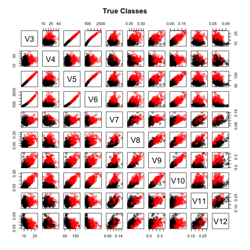
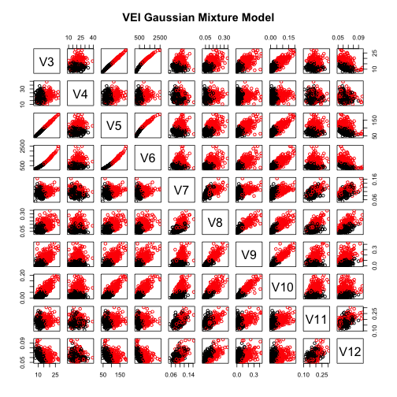
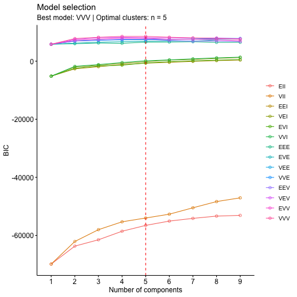
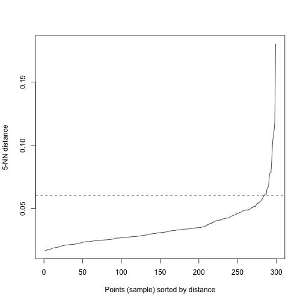
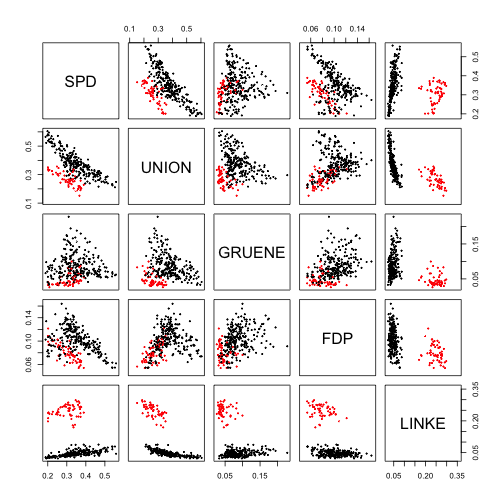
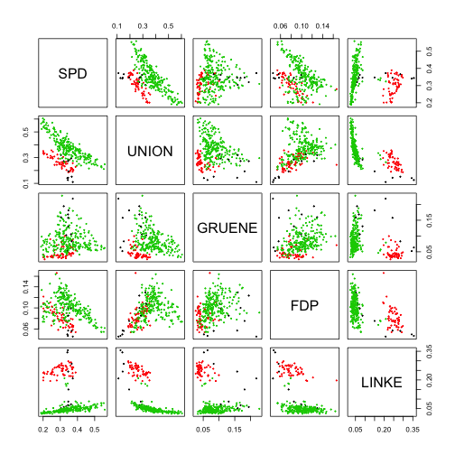

# Exercise 1


```r
library(mclust)
library(cluster)
library(mclust)
library(smacof)
library(factoextra)
library(dbscan)
library(knitr)
d=read.table("wdbc.data.txt",header = F,sep=",")
wdbcc <- d[,3:12]
wdbcdiag <- as.integer(d[,2])
wdbcc.2=wdbcc^2
wdbcc.2s=scale(wdbcc.2)


###Exercise 1

ARI<- matrix(0, nrow = 1, ncol = 9)
colnames(ARI)=c("Kmeans","Average","Complete","Single","Ward", "pam","VVV","EVI","VEI")
rownames(ARI)=c("ARI")

kmeans=kmeans(wdbcc.2s,2,nstart=100)
ARI[1,1]=adjustedRandIndex(kmeans$cluster,wdbcdiag)


dist.m=dist(wdbcc.2s,method = "euclidean")
clust.avg <- hclust(as.dist(dist.m),method="average")
clust.avg=cutree(clust.avg,2)
ARI[1,2]=adjustedRandIndex(clust.avg,wdbcdiag)

clust.c <- hclust(as.dist(dist.m),method="complete")
clust.c=cutree(clust.c,2)
ARI[1,3]= adjustedRandIndex(clust.c,wdbcdiag)


clust.s <- hclust(as.dist(dist.m),method="single")
clust.s=cutree(clust.s,2)
ARI[1,4]= adjustedRandIndex(clust.s,wdbcdiag)

clust.w <- hclust(as.dist(dist.m),method="ward.D2")
clust.w=cutree(clust.w,2)
ARI[1,5]= adjustedRandIndex(clust.w,wdbcdiag)

pam=pam(as.dist(dist.m),2)
ARI[1,6] = adjustedRandIndex(pam$cluster,wdbcdiag)


clust.m=Mclust(wdbcc,modelName="VVV",G=2)
```

```
## fitting ...
## 
  |                                                                                        
  |                                                                                  |   0%
  |                                                                                        
  |=========================================                                         |  50%
  |                                                                                        
  |==================================================================================| 100%
```

```r
ARI[1,7]= adjustedRandIndex(clust.m$classification,wdbcdiag)


clust.m=Mclust(wdbcc,modelName="EVI",G=2)
```

```
## fitting ...
## 
  |                                                                                        
  |                                                                                  |   0%
  |                                                                                        
  |=========================================                                         |  50%
  |                                                                                        
  |==================================================================================| 100%
```

```r
ARI[1,8]=adjustedRandIndex(clust.m$classification,wdbcdiag)

clust.m=Mclust(wdbcc,modelName="VEI",G=2)
```

```
## fitting ...
## 
  |                                                                                        
  |                                                                                  |   0%
  |                                                                                        
  |=========================================                                         |  50%
  |                                                                                        
  |==================================================================================| 100%
```

```r
ARI[1,9]=adjustedRandIndex(clust.m$classification,wdbcdiag)
```


$$\\[1in]$$


```r
kable(ARI)
```


|    |    Kmeans|   Average|  Complete|    Single|      Ward|       pam|       VVV|      EVI|       VEI|
|:---|---------:|---------:|---------:|---------:|---------:|---------:|---------:|--------:|---------:|
|ARI | 0.4815654| 0.0224333| 0.0667687| 0.0024029| 0.6190487| 0.6402579| 0.6265249| 0.669858| 0.6769713|

As we can see the  highest value of ARI is given by the VEI Gaussian Mixture model, so we assume that:

-the within cluster covariance matrix is diagonal and this means that we have a different variance for each variable but they are not corralated. 

-We also introduce varying volume and this means that the clusters are different in terms of within cluster variation. 

-We assume that the shape of the clusters is the same.


```r
clust.m$classification[clust.m$classification==1]=3
clust.m$classification[clust.m$classification==2]=1
clust.m$classification[clust.m$classification==3]=2
pairs(wdbcc,col=wdbcdiag, main="True Classes")
```



```r
pairs(wdbcc,col=clust.m$classification, main="VEI Gaussian Mixture Model")
```



As we can see the two pairs-plot look similar, so this confirms that the the method is pretty good at assigning each observation to the correct cluster.


# Exercise 2


```r
ASW<- matrix(0, nrow = 2, ncol = 5)
colnames(ASW)=c("Single Linkage","Complete Linkage","Average Linkage","Ward's Method", "pam")
rownames(ASW)=c("ASW","Number of clusters")

#Single
clust.s <- hclust(as.dist(dist.m),method="single")
tasw <- NA
tclusk <- list()
tsil <- list()
for (k in 2:30){
  tclusk[[k]] <- cutree(clust.s,k)
  tsil[[k]] <- silhouette(tclusk[[k]],dist=as.dist(dist.m))
  tasw[k] <- summary(silhouette(tclusk[[k]],dist=as.dist(dist.m)))$avg.width
}
ASW[2,1]=match(max(tasw[-1]),tasw[-1])+1
ASW[1,1]=max(tasw[-1])

#Complete
clust.c <- hclust(as.dist(dist.m),method="complete")
tasw <- NA
tclusk <- list()
tsil <- list()
for (k in 2:30){
  tclusk[[k]] <- cutree(clust.c,k)
  tsil[[k]] <- silhouette(tclusk[[k]],dist=as.dist(dist.m))
  tasw[k] <- summary(silhouette(tclusk[[k]],dist=as.dist(dist.m)))$avg.width
}
ASW[2,2]=match(max(tasw[-1]),tasw[-1])+1
ASW[1,2]=max(tasw[-1])


#Average
clust.avg <- hclust(as.dist(dist.m),method="average")
tasw <- NA
tclusk <- list()
tsil <- list()
for (k in 2:30){
  tclusk[[k]] <- cutree(clust.avg,k)
  tsil[[k]] <- silhouette(tclusk[[k]],dist=as.dist(dist.m))
  tasw[k] <- summary(silhouette(tclusk[[k]],dist=as.dist(dist.m)))$avg.width
}
ASW[2,3]=match(max(tasw[-1]),tasw[-1])+1
ASW[1,3]=max(tasw[-1])

#Ward
clust.w <- hclust(as.dist(dist.m),method="ward.D2")
tasw <- NA
tclusk <- list()
tsil <- list()
for (k in 2:30){
  tclusk[[k]] <- cutree(clust.w,k)
  tsil[[k]] <- silhouette(tclusk[[k]],dist=as.dist(dist.m))
  tasw[k] <- summary(silhouette(tclusk[[k]],dist=as.dist(dist.m)))$avg.width
}
ASW[2,4]=match(max(tasw[-1]),tasw[-1])+1
ASW[1,4]=max(tasw[-1])

#Pam

pasw <- NA
pclusk <- list()
psil <- list()
for (k in 2:30){
  pclusk[[k]] <-pam(as.dist(dist.m),k)
  # Computation of silhouettes:
  psil[[k]] <- silhouette(pclusk[[k]],dist=as.dist(dist.m))
  # ASW needs to be extracted:
  pasw[k] <- summary(psil[[k]])$avg.width
}

ASW[2,5]=match(max(pasw[-1]),pasw[-1])+1
ASW[1,5]=max(pasw[-1])

kable(ASW)
```


|                   | Single Linkage| Complete Linkage| Average Linkage| Ward's Method|       pam|
|:------------------|--------------:|----------------:|---------------:|-------------:|---------:|
|ASW                |       0.666414|        0.5955029|       0.6776734|     0.3729325| 0.3967959|
|Number of clusters |       3.000000|        2.0000000|       2.0000000|     2.0000000| 2.0000000|

As we can see the suggested number of cluster matches the real one except for Single Linkage. The highest values for ASW are given by single, complete and average linkage so we obtain a result that is completly in contrast with what we have seen before with ARI, the values of this method were approximately equal to zero. This experiment suggests that we can't always trust  ASW because it can lead us to using methods that produce very poor results


```r
clust=Mclust(wdbcc)
```

```
## fitting ...
## 
  |                                                                                        
  |                                                                                  |   0%
  |                                                                                        
  |=                                                                                 |   1%
  |                                                                                        
  |=                                                                                 |   2%
  |                                                                                        
  |==                                                                                |   2%
  |                                                                                        
  |===                                                                               |   3%
  |                                                                                        
  |===                                                                               |   4%
  |                                                                                        
  |====                                                                              |   5%
  |                                                                                        
  |=====                                                                             |   6%
  |                                                                                        
  |======                                                                            |   7%
  |                                                                                        
  |======                                                                            |   8%
  |                                                                                        
  |=======                                                                           |   9%
  |                                                                                        
  |========                                                                          |   9%
  |                                                                                        
  |========                                                                          |  10%
  |                                                                                        
  |=========                                                                         |  11%
  |                                                                                        
  |==========                                                                        |  12%
  |                                                                                        
  |==========                                                                        |  13%
  |                                                                                        
  |===========                                                                       |  13%
  |                                                                                        
  |============                                                                      |  14%
  |                                                                                        
  |============                                                                      |  15%
  |                                                                                        
  |=============                                                                     |  16%
  |                                                                                        
  |==============                                                                    |  17%
  |                                                                                        
  |===============                                                                   |  18%
  |                                                                                        
  |===============                                                                   |  19%
  |                                                                                        
  |================                                                                  |  20%
  |                                                                                        
  |=================                                                                 |  20%
  |                                                                                        
  |=================                                                                 |  21%
  |                                                                                        
  |==================                                                                |  22%
  |                                                                                        
  |===================                                                               |  23%
  |                                                                                        
  |===================                                                               |  24%
  |                                                                                        
  |====================                                                              |  24%
  |                                                                                        
  |=====================                                                             |  25%
  |                                                                                        
  |=====================                                                             |  26%
  |                                                                                        
  |======================                                                            |  27%
  |                                                                                        
  |=======================                                                           |  28%
  |                                                                                        
  |========================                                                          |  29%
  |                                                                                        
  |=========================                                                         |  30%
  |                                                                                        
  |=========================                                                         |  31%
  |                                                                                        
  |==========================                                                        |  31%
  |                                                                                        
  |==========================                                                        |  32%
  |                                                                                        
  |===========================                                                       |  33%
  |                                                                                        
  |============================                                                      |  34%
  |                                                                                        
  |============================                                                      |  35%
  |                                                                                        
  |=============================                                                     |  35%
  |                                                                                        
  |==============================                                                    |  36%
  |                                                                                        
  |==============================                                                    |  37%
  |                                                                                        
  |===============================                                                   |  38%
  |                                                                                        
  |================================                                                  |  39%
  |                                                                                        
  |=================================                                                 |  40%
  |                                                                                        
  |==================================                                                |  41%
  |                                                                                        
  |==================================                                                |  42%
  |                                                                                        
  |===================================                                               |  43%
  |                                                                                        
  |====================================                                              |  43%
  |                                                                                        
  |====================================                                              |  44%
  |                                                                                        
  |=====================================                                             |  45%
  |                                                                                        
  |=====================================                                             |  46%
  |                                                                                        
  |======================================                                            |  46%
  |                                                                                        
  |=======================================                                           |  47%
  |                                                                                        
  |=======================================                                           |  48%
  |                                                                                        
  |========================================                                          |  49%
  |                                                                                        
  |=========================================                                         |  50%
  |                                                                                        
  |==========================================                                        |  51%
  |                                                                                        
  |===========================================                                       |  52%
  |                                                                                        
  |===========================================                                       |  53%
  |                                                                                        
  |============================================                                      |  54%
  |                                                                                        
  |=============================================                                     |  54%
  |                                                                                        
  |=============================================                                     |  55%
  |                                                                                        
  |==============================================                                    |  56%
  |                                                                                        
  |==============================================                                    |  57%
  |                                                                                        
  |===============================================                                   |  57%
  |                                                                                        
  |================================================                                  |  58%
  |                                                                                        
  |================================================                                  |  59%
  |                                                                                        
  |=================================================                                 |  60%
  |                                                                                        
  |==================================================                                |  61%
  |                                                                                        
  |===================================================                               |  62%
  |                                                                                        
  |====================================================                              |  63%
  |                                                                                        
  |====================================================                              |  64%
  |                                                                                        
  |=====================================================                             |  65%
  |                                                                                        
  |======================================================                            |  65%
  |                                                                                        
  |======================================================                            |  66%
  |                                                                                        
  |=======================================================                           |  67%
  |                                                                                        
  |========================================================                          |  68%
  |                                                                                        
  |========================================================                          |  69%
  |                                                                                        
  |=========================================================                         |  69%
  |                                                                                        
  |=========================================================                         |  70%
  |                                                                                        
  |==========================================================                        |  71%
  |                                                                                        
  |===========================================================                       |  72%
  |                                                                                        
  |============================================================                      |  73%
  |                                                                                        
  |=============================================================                     |  74%
  |                                                                                        
  |=============================================================                     |  75%
  |                                                                                        
  |==============================================================                    |  76%
  |                                                                                        
  |===============================================================                   |  76%
  |                                                                                        
  |===============================================================                   |  77%
  |                                                                                        
  |================================================================                  |  78%
  |                                                                                        
  |=================================================================                 |  79%
  |                                                                                        
  |=================================================================                 |  80%
  |                                                                                        
  |==================================================================                |  80%
  |                                                                                        
  |===================================================================               |  81%
  |                                                                                        
  |===================================================================               |  82%
  |                                                                                        
  |====================================================================              |  83%
  |                                                                                        
  |=====================================================================             |  84%
  |                                                                                        
  |======================================================================            |  85%
  |                                                                                        
  |======================================================================            |  86%
  |                                                                                        
  |=======================================================================           |  87%
  |                                                                                        
  |========================================================================          |  87%
  |                                                                                        
  |========================================================================          |  88%
  |                                                                                        
  |=========================================================================         |  89%
  |                                                                                        
  |==========================================================================        |  90%
  |                                                                                        
  |==========================================================================        |  91%
  |                                                                                        
  |===========================================================================       |  91%
  |                                                                                        
  |============================================================================      |  92%
  |                                                                                        
  |============================================================================      |  93%
  |                                                                                        
  |=============================================================================     |  94%
  |                                                                                        
  |==============================================================================    |  95%
  |                                                                                        
  |===============================================================================   |  96%
  |                                                                                        
  |===============================================================================   |  97%
  |                                                                                        
  |================================================================================  |  98%
  |                                                                                        
  |================================================================================= |  98%
  |                                                                                        
  |================================================================================= |  99%
  |                                                                                        
  |==================================================================================| 100%
```

```r
fviz_mclust_bic(clust, model.names = NULL, shape = 1,
                color = "model", palette = NULL, legend = NULL,
                main = "Model selection", xlab = "Number of components",
                ylab = "BIC")
```



In this case the best result is given by the VVV model with number of clusters equal to five, again we a solution that is pretty far from the reality.


# Exercise 3

## a)

DBSCAN builts clusters acording to this definitions:

1) A point in order to belong to a certain cluster must be density-reachable from at least one point that belongs to that cluster. 

2) All points of the cluster must be at least density connected.

The DBSCAN has two parameters:

1) MinPts: minumum number of points that are directly density-reachable from p, so that p can be considered a core point

2) Eps: Threshold of the distance between two points p and q such that q can be considered belonging to the Eps-neighborhood of p.

The algorithm starts by visiting an arbitrary point p and retriving its Eps-neighborhood and if the number of points belonging to it are larger than MinPts, a new cluster is started, otherwise the point will be labeled as noise. The process of retriving the Eps-neighborhood is done for every point belonging to the original one until all density-connected points from p are found, this will define the first cluster. This is done for all the remaining unvisited points and this will result in finding a new cluster or labeling a point as noise.


## b)

According to the authors we have three main advantages:

1) Minimal requirements of domain knowledge to determine the input parameters: 

We have to provide just one parameter (Eps) to make the algorithm work and this step is also supported. For partitioing algorithms like kmeans we have to provide the number of clusters k and most of the times we don't have enough information to make a correct decision about it. Also for hierarchical algorithms we have problems identifying the parameters for a termination codition that separetes the natural clusters and doesn't split them in two parts

2) Discovery of clusters with arbitrary shape:

the shape of all clusters found by a partitioning algorithms is convex, for hierarchical ones this problem is connected with the derivation of the correct parameters for a termination condition.

3)  Good efficiency on large databases:

The above mentioned problems can be solved for partitioning and hierarchical algorithms by some upgrated versions of the standard ones like CLARANS and Ejcluster, but DBSCAN offers a less computationally demanding solution.
In the paper it is shown that DBSCAN outperforms CLARANS by a factor of between 250 and 1900 which grows with increasing size of the database.

The authors' arguments seem very convincing on the datasets that are presented on the paper considerig the above advantages, but it may have some problems when for example the clusters are not well separated; in this case maybe it would consider them as one so other partitioning or hierarchical algorithms can be preferable.

## c)


```r
d=read.table("bundestag.dat.txt",header = T,sep="")
data=d[,1:5]

kNNdistplot(data, k = 5)
abline(h=.06, col = "red", lty=2)
```



In order to make DBSCAN work we have to decide the value of Eps and MinPts. Usually a rule of thumb is to set MinPts equal to the number of variables in our dataset plus onem, so in our case MinPts=5. One tool to define Eps is the kNNdistplot, where in the y-axis we have the distances from a point to its fifth nearest neighbour and on the x-axis the points ordered according to the cited distances in increasing order. The idea is that points inside a cluster will a have small value of the k-nearest neighbor distance because they are close to other points in the same cluster, while noise points are isolated and will have a rather large kNN distance. So we have to find an elbow on the curve and points after that threshold will be regarded as noise. In this case we consider Eps=0.06.


```r
res <- dbscan(data, eps = 0.06, minPts = 5)
pairs(data,cex=0.3,col=res$cluster)
```



```r
pairs(data,cex=0.3,col=d$ewb)
```



```r
adjustedRandIndex(res$cluster,d$ewb)
```

```
## [1] 0.8660779
```
 
As we can see (except for the different indexing of the clusters that rsults in different colours in the two graphs) the clusters produced by DBSCAN seem to match pretty well the macro-areas both from the graphical point of view and ARI.


